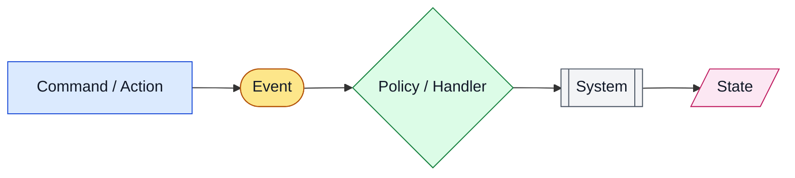
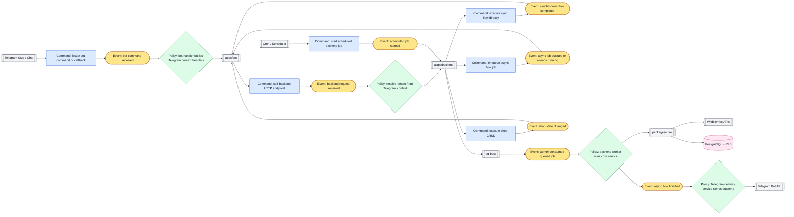
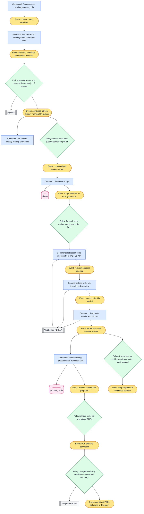
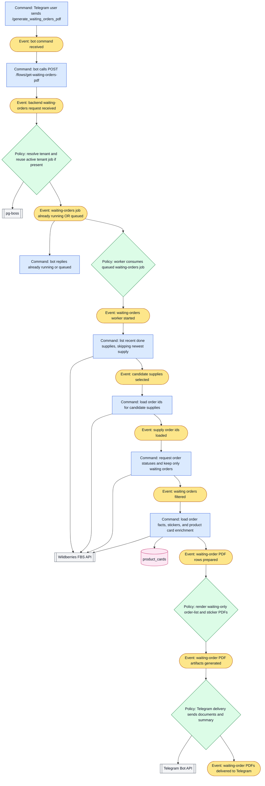
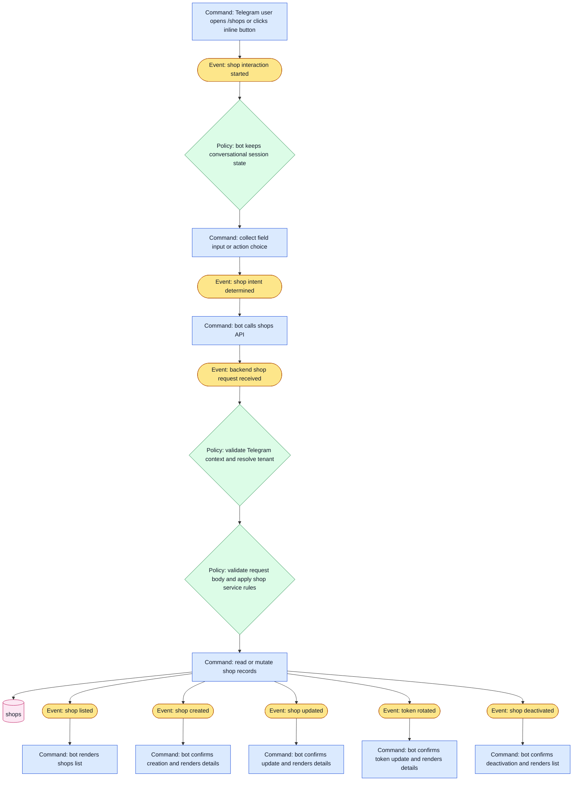
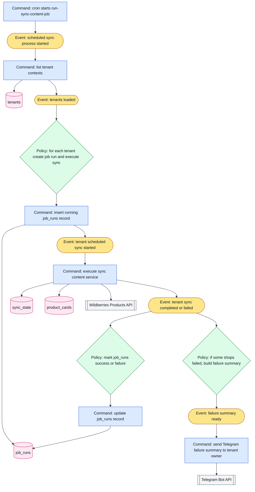
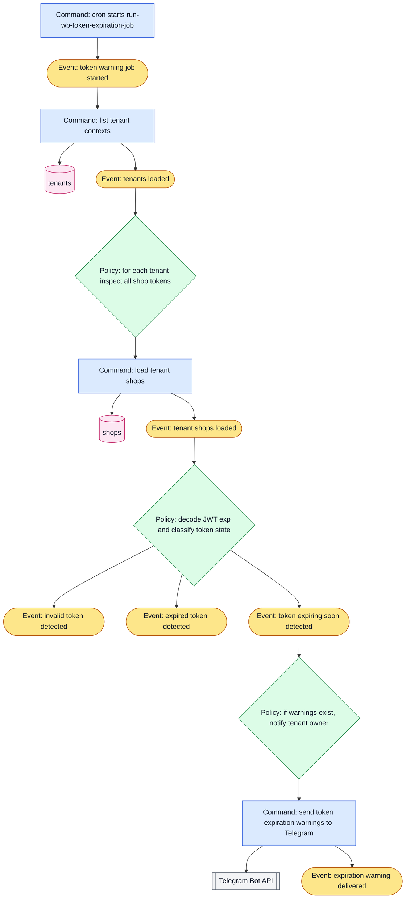

# Current Flows

This document maps the current Telegram-first system using an event-storming style.

The diagrams focus on:

- actions or commands that start behavior
- events produced by those actions
- policies or handlers that react to events
- external systems involved in the flow
- important persisted state changes

## Legend

- `Command` = user action, bot action, controller action, worker action
- `Event` = something that happened and can trigger the next step
- `Policy` = rule or handler that reacts to an event
- `System` = external or internal system boundary
- `State` = persisted data or read model updated during the flow



## 1. System Overview



## 2. `process_all_shops` Flow

This is the main synchronous operator flow. The bot waits for the backend result, then sends the summary and any QR images.

```mermaid
flowchart TD
    c1[Command: Telegram user sends /process_all_shops]:::command --> e1([Event: bot command received]):::event
    e1 --> c2[Command: bot replies "running" and calls POST /flows/process-all-shops]:::command
    c2 --> e2([Event: backend process-all request received]):::event
    e2 --> p1{Policy: validate Telegram headers and resolve tenant}:::policy
    p1 --> c3[Command: list active shops for tenant]:::command
    c3 --> s1[(shops)]:::state
    c3 --> e3([Event: active shops loaded]):::event

    e3 --> p2{Policy: for each active shop run FBS orchestration}:::policy
    p2 --> c4[Command: call WB GET /orders/new]:::command
    c4 --> wb[[Wildberries FBS API]]:::system
    c4 --> e4([Event: new orders fetched]):::event

    e4 --> p3{Policy: filter out orders requiring meta or sgtin}:::policy
    p3 --> e5([Event: eligible orders determined]):::event

    e5 --> p4{Policy: if no eligible orders -> mark shop skipped}:::policy
    p4 --> e6([Event: shop skipped]):::event

    e5 --> p5{Policy: resolve open supply or create new one}:::policy
    p5 --> c5[Command: list supplies]:::command
    c5 --> wb
    c5 --> e7([Event: open supply searched]):::event
    e7 --> c6[Command: create supply if none is open]:::command
    c6 --> wb
    c6 --> e8([Event: supply resolved]):::event

    e8 --> c7[Command: add eligible orders to supply in batches]:::command
    c7 --> wb
    c7 --> e9([Event: orders attached to supply]):::event

    e9 --> c8[Command: deliver supply]:::command
    c8 --> wb
    c8 --> e10([Event: supply delivery requested]):::event

    e10 --> p6{Policy: poll until supply is closed or timeout}:::policy
    p6 --> c9[Command: poll WB supply status]:::command
    c9 --> wb
    c9 --> e11([Event: supply closed or timeout reached]):::event

    e11 --> c10[Command: fetch supply barcode PNG]:::command
    c10 --> wb
    c10 --> e12([Event: shop processed successfully]):::event

    e6 --> e13([Event: per-shop result accumulated]):::event
    e12 --> e13
    e11 --> p7{Policy: on failure, capture error}:::policy
    p7 --> e14([Event: shop failed]):::event
    e14 --> e13

    e13 --> p8{Policy: aggregate all shop results}:::policy
    p8 --> e15([Event: process-all flow completed]):::event
    e15 --> c11[Command: backend returns result to bot]:::command
    c11 --> e16([Event: bot received process-all result]):::event
    e16 --> c12[Command: bot sends summary message]:::command
    e16 --> c13[Command: bot sends QR images for successful shops]:::command

    classDef command fill:#dbeafe,stroke:#1d4ed8,color:#111827,stroke-width:1px;
    classDef event fill:#fde68a,stroke:#b45309,color:#111827,stroke-width:1px;
    classDef policy fill:#dcfce7,stroke:#15803d,color:#111827,stroke-width:1px;
    classDef system fill:#f3f4f6,stroke:#4b5563,color:#111827,stroke-width:1px;
    classDef state fill:#fce7f3,stroke:#be185d,color:#111827,stroke-width:1px;
```

## 3. `sync_content_shops` Async Flow

This is already fire-and-forget from the operator point of view.

```mermaid
flowchart TD
    c1[Command: Telegram user sends /sync_content_shops]:::command --> e1([Event: bot command received]):::event
    e1 --> c2[Command: bot calls POST /flows/sync-content-shops/async]:::command
    c2 --> e2([Event: backend async sync request received]):::event
    e2 --> p1{Policy: resolve tenant and check existing active job for tenant}:::policy
    p1 --> queue[[pg-boss]]:::system
    p1 --> e3([Event: sync job already running OR sync job accepted]):::event

    e3 --> c3[Command: bot replies already running or queued]:::command

    e3 --> p2{Policy: when accepted, enqueue sync-content job}:::policy
    p2 --> e4([Event: sync-content job queued]):::event
    e4 --> queue
    queue --> e5([Event: sync-content worker picked job]):::event

    e5 --> p3{Policy: run sync content service with progress logging}:::policy
    p3 --> c4[Command: list active shops]:::command
    c4 --> s1[(shops)]:::state
    c4 --> e6([Event: shops selected for sync]):::event

    e6 --> p4{Policy: sync each shop, up to parallel worker limit}:::policy
    p4 --> c5[Command: set sync_state to running]:::command
    c5 --> s2[(sync_state)]:::state
    c5 --> e7([Event: shop sync started]):::event

    e7 --> c6[Command: request cards page from WB products API]:::command
    c6 --> wb[[Wildberries Products API]]:::system
    c6 --> e8([Event: cards page fetched]):::event

    e8 --> p5{Policy: map cards and upsert product cards}:::policy
    p5 --> c7[Command: upsert product cards]:::command
    c7 --> s3[(product_cards)]:::state
    c7 --> e9([Event: product cards persisted]):::event

    e9 --> p6{Policy: if page indicates more data, delay and fetch next page}:::policy
    p6 --> c6

    e9 --> p7{Policy: if collection finished, finalize shop sync state}:::policy
    p7 --> c8[Command: set sync_state success with latest cursor]:::command
    c8 --> s2
    c8 --> e10([Event: shop sync succeeded]):::event

    e8 --> p8{Policy: on error, restore previous cursor and store failure}:::policy
    p8 --> c9[Command: set sync_state failed with lastError]:::command
    c9 --> s2
    c9 --> e11([Event: shop sync failed]):::event

    e10 --> e12([Event: tenant sync result accumulated]):::event
    e11 --> e12

    e12 --> p9{Policy: aggregate tenant sync result}:::policy
    p9 --> e13([Event: sync-content flow completed or failed]):::event
    e13 --> p10{Policy: Telegram delivery service notifies chat}:::policy
    p10 --> tgapi[[Telegram Bot API]]:::system
    p10 --> e14([Event: completion or failure message delivered to Telegram]):::event

    classDef command fill:#dbeafe,stroke:#1d4ed8,color:#111827,stroke-width:1px;
    classDef event fill:#fde68a,stroke:#b45309,color:#111827,stroke-width:1px;
    classDef policy fill:#dcfce7,stroke:#15803d,color:#111827,stroke-width:1px;
    classDef system fill:#f3f4f6,stroke:#4b5563,color:#111827,stroke-width:1px;
    classDef state fill:#fce7f3,stroke:#be185d,color:#111827,stroke-width:1px;
```



## 4. `generate_pdfs` Async Flow

This generates combined pick-list and sticker PDFs for recent supplies.



## 5. `generate_waiting_orders_pdf` Async Flow

This reuses the PDF generation pipeline but adds a waiting-status filtering step.



## 6. Shop CRUD Flow

The bot handles the operator interaction, but the backend owns the actual CRUD rules.



## 7. Scheduled Sync Flow

This is similar to manual sync, but it is started by cron, runs per tenant, writes `job_runs`, and only sends Telegram summaries for failures.



## 8. Scheduled WB Token Expiration Warning Flow

This is a pure scheduled monitoring flow. It reads shop tokens, decodes JWT expiration, and warns owners in Telegram.



## Observations About the Current Architecture

- Telegram is the only user-facing client today.
- The bot stays thin and mostly translates chat actions into backend HTTP calls.
- Tenant identity is currently derived from Telegram metadata, not from a login session.
- `process_all_shops` is synchronous from the operator perspective.
- `sync_content_shops`, `generate_pdfs`, and `generate_waiting_orders_pdf` already behave like fire-and-forget jobs.
- Async completion is pushed back to Telegram by the backend instead of being pulled by a dashboard.
- The DB already stores useful operational state in `shops`, `product_cards`, `sync_state`, and `job_runs`.

## Why This Matters for the Web App

These diagrams show that the backend already owns the business workflows. That is why the migration to a web app can focus on:

- replacing Telegram as the client
- replacing Telegram-based auth context with session-based auth
- replacing Telegram delivery with web job/status views
- exposing current state and metadata through dashboard-friendly endpoints
